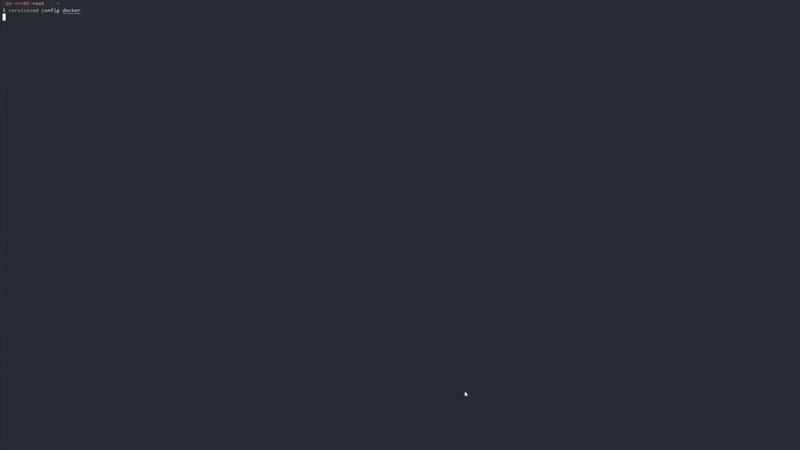

# servicecmd

A set of Node.js CLI tools that enables the users to manage and monitor multiple docker-compose stacks by grouping them in to folders and ability to filter them.

<!-- toc -->
<!-- tocstop -->

# Base Package

## [@servicecmd/cli](./packages/cli/README.md)

    

This is the base of the @servicecmd. All other features will extend the capabilities of the default CLI.

This CLI enables the user to proxy commands to multiple docker-compose stacks.

# Plugins

## [@servicecmd/daemon](./packages/daemon/README.md)

> **WIP**

Will extend the default cli to have daemon capabilities that will connect to the message queue and monitored through the frontend/backend application.

## [@servicecmd/frontend](./packages/frontend/README.md)

> **WIP**

Will add a frontend to control/monitor multiple servers from the same place.

## [@servicecmd/backend](./packages/backend/README.md)

> **WIP**

Will add a backend to control/monitor multiple servers from the same place.
